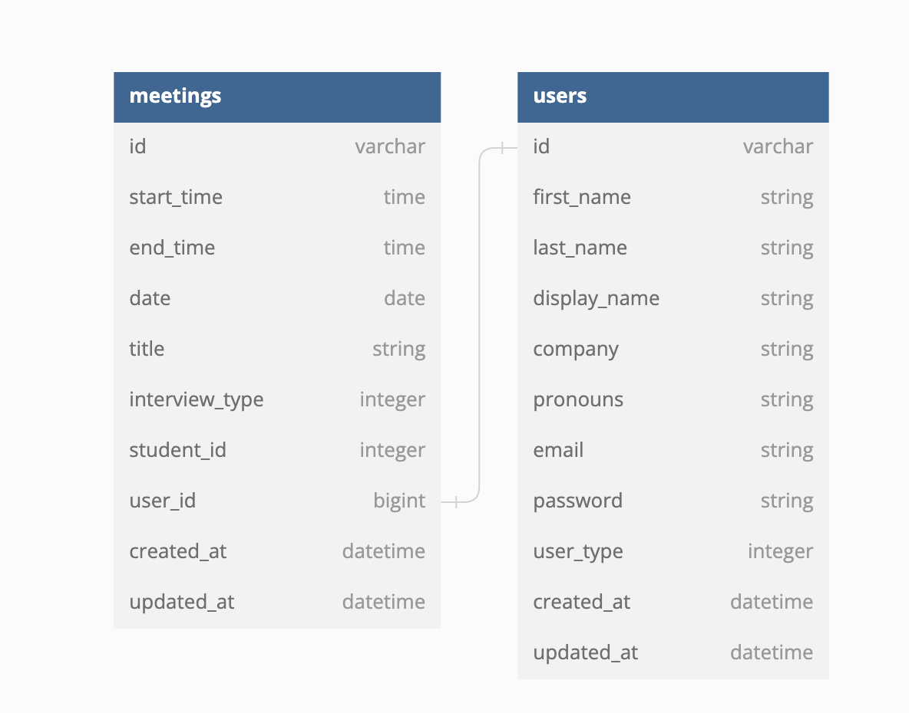

# **Interview Buddy BE**

  

## **Table of Contents**
- [Background and Description](#background-and-description)
- [Schema](#schema)
- [GraphQl Endpoints](#graphql-endpoints)
  - [Queries](#queries)
  - [Mutations](#mutations)
- [Contributors](#contributors)

## **Schema**

  

## **GraphQL Endpoints**
For detailed examples of the endpoints with example responses click the specific query or mutation below.

- Queries
  - User Queries
    - [Return all Users](./docs/graphql/queries.md)
    - [Return a User by UUID](./docs/graphql/queries.md)
  - Meeting Queries
- Mutations
  - User Mutations
    - [createUser](./docs/graphql/mutations.md#user-m)
    - [updateUser](./docs/graphql/mutations.md#update-user)
    - [deleteUser](./docs/graphql/mutations.md#delete-user)
  - Meeting Mutations
    - [createMeeting](./docs/graphql/mutations.md#meeting-m)
    - [updateMeeting](./docs/graphql/mutations.md#update-meeting)
    - [deleteMeeting](./docs/graphql/mutations.md#delete-meeting)