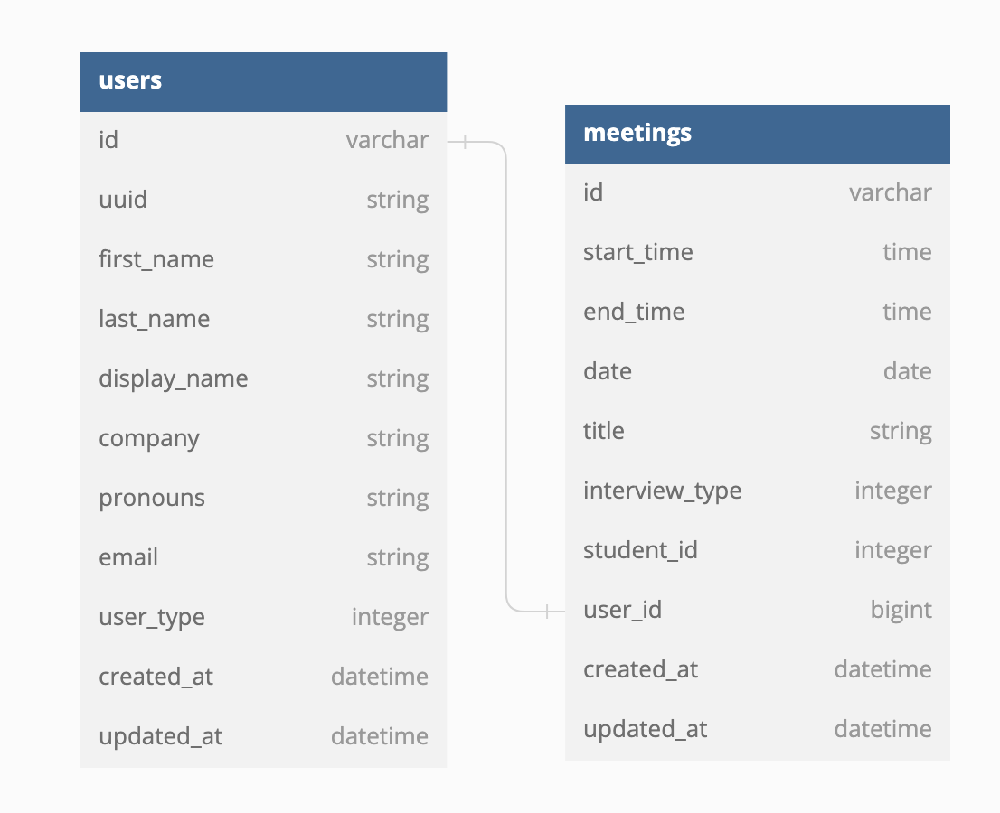

# **Interview Buddy BE**

  

## **Table of Contents**
- [Background and Description](#background-and-description)
- [Schema](#schema)
- [GraphQl Endpoints](#graphql-endpoints)
  - [Queries](#queries)
  - [Mutations](#mutations)
- [Contributors](#contributors)

## Background and Description
This application is being created to help pair job seekers with industry professionals, for practicing various interview scenarios. The current iteration is intended for use at <a href="https://turing.edu/">Turing School of Software & Design</a>. As we approach MVP, there will be continuous updates to this application - content of this README is subject to change.

## **Schema**

  

## **GraphQL Endpoints**
For detailed examples of the endpoints with example responses click the specific query or mutation below.

- [Queries](./docs/graphql/queries.md)
  - [User Queries](./docs/graphql/queries.md#user-q)
    - [Get all Users](./docs/graphql/queries.md#get-users)
    - [Get a User by UUID](./docs/graphql/queries.md#get-user)
    - [Get Users by Company](./docs/graphql/queries.md#get-users-by-company)
  - [Meeting Queries](./docs/graphql/queries.md#meeting-q)
    - [Get all Meetings](./docs/graphql/queries.md#get-meetings)
    - [Get a Meeting by UserID](./docs/graphql/queries.md#get-meeting-user-id)
    - [Get a Meeting by Interview Type](./docs/graphql/queries.md#get-meeting-interview-type)
    - [Get Meetings by Date](./docs/graphql/queries.md#get-meetings-date)
- [Mutations](./docs/graphql/mutations.md)
  - [User Mutations](/docs/graphql/mutations.md#user-m)
    - [createUser](./docs/graphql/mutations.md#create-user)
    - [updateUser](./docs/graphql/mutations.md#update-user)
    - [deleteUser](./docs/graphql/mutations.md#delete-user)
  - [Meeting Mutations](./docs/graphql/mutations.md#meeting-m)
    - [createMeeting](./docs/graphql/mutations.md#meeting-m)
    - [updateMeeting](./docs/graphql/mutations.md#update-meeting)
    - [deleteMeeting](./docs/graphql/mutations.md#delete-meeting)

## **Contributors**

<table>
  <tr>
    <td align="center"> <b>Joseph Downs (he/him)</b></a>  <a href="https://github.com/josephdowns" title ="GitHub"></td>
    <td align="center"> <b>Colin Reinhart (he/him)</b></a>  <a href="https://github.com/ColinReinhart" title ="GitHub"></td>
  </tr>
</table>